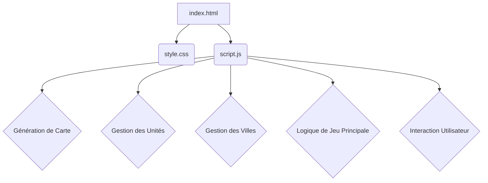

# Plan de Développement : CivWeb

## I. Objectif du Projet

CivWeb est un projet visant à créer une implémentation simplifiée d'un jeu de stratégie au tour par tour inspiré de la série Civilization, entièrement développé en HTML, CSS et JavaScript pur. L'objectif principal est de démontrer la faisabilité de jeux interactifs complexes côté client sans dépendances serveur, tout en offrant une expérience de jeu légère et accessible.

## II. Architecture Technique

CivWeb est une application web front-end autonome. L'architecture est basée sur une séparation claire des responsabilités entre HTML pour la structure, CSS pour le style, et JavaScript pour la logique du jeu.

*   **`index.html`**: Structure de base de la page web et de l'interface utilisateur. Il contient les conteneurs pour la carte, les panneaux d'information, et les messages du jeu.
*   **`style.css`**: Définit l'apparence visuelle du jeu, y compris la disposition de la carte, les styles des tuiles, des unités, des villes et des panneaux d'information.
*   **`script.js`**: Le cœur de la logique du jeu. Il gère la génération de la carte, les classes des entités (Unit, City), la logique des tours, les combats, la recherche technologique et toutes les interactions utilisateur.

## III. Composants Clés du Projet

1.  **Module de Génération de Carte**:
    *   `getRandomTileType()`: Sélectionne un type de tuile aléatoire.
    *   `getRandomResource()`: Sélectionne une ressource aléatoire pour une tuile.
    *   `generateMap()`: Crée la grille HTML de la carte, assigne les types de tuiles et les ressources, et attache les écouteurs d'événements.

2.  **Classes de Jeu (Entités)**:
    *   **`Unit`**:
        *   Gestion de la position, du type (colon, guerrier, ouvrier, barbare), des points de mouvement, de la force et de la santé.
        *   Méthodes pour la création de l'élément DOM, la mise à jour de l'infobulle, la gestion des dégâts, la mort, l'attaque et le déplacement.
    *   **`City`**:
        *   Gestion de la position, du nom, de la population, des ressources accumulées et de l'élément de production actuel.
        *   Méthodes pour la création de l'élément DOM, la mise à jour de l'infobulle, la production de ressources et la complétion de la production (création d'unités).

3.  **Logique de Jeu Principale**:
    *   `playerUnits`, `playerCities`: Tableaux globaux pour suivre les entités du joueur.
    *   `currentTurn`, `currentResearch`, `researchProgress`: Variables d'état du jeu.
    *   `nextTurn()`: Fonction principale orchestrant le déroulement d'un tour (recherche, production des villes, actions des unités, apparition des barbares, vérification des conditions de fin de partie).
    *   `checkGameEndConditions()`: Vérifie les conditions de victoire (nombre de villes) et de défaite (plus d'unités/villes).

4.  **Module d'Interaction Utilisateur**:
    *   `handleTileClick(event)`: Gère la sélection des tuiles, le mouvement des unités et les attaques.
    *   `handleKeyPress(event)`: Gère les raccourcis clavier pour les actions spécifiques des unités (fonder ville, construire ferme/mine/route, dégager forêt, etc.).
    *   Fonctions pour afficher/masquer les panneaux d'information (`showCityInfo`, `hideCityInfo`, `showTechPanel`, `hideTechPanel`).
    *   Fonctions pour la production d'unités dans les villes (`buildWarrior`, `buildSettler`, `buildWorker`).
    *   `addGameMessage(message, type)`: Gère l'affichage des messages dans le journal du jeu.
    *   `updateTechPanel()`, `startResearch(techName)`: Gèrent l'interface et la logique de l'arbre technologique.

## IV. Étapes d'Implémentation (Ordre Suggéré)

1.  **Phase 1 - Structure de Base et Rendu de la Carte**:
    *   Création de `index.html` avec les conteneurs de base.
    *   Mise en place de `style.css` pour la disposition générale et les styles de tuiles.
    *   Implémentation de `generateMap()` dans `script.js` pour le rendu initial de la carte.

2.  **Phase 2 - Gestion des Unités et Mouvement**:
    *   Définition de la classe `Unit` avec les propriétés de base et la création de l'élément DOM.
    *   Implémentation de `moveTo()` et `handleTileClick()` pour le mouvement des unités.
    *   Ajout des unités initiales (Colon).

3.  **Phase 3 - Villes et Production**:
    *   Définition de la classe `City` avec les propriétés de base et la création de l'élément DOM.
    *   Implémentation de la logique de fondation de ville (`B` raccourci clavier).
    *   Développement de la méthode `produce()` pour la gestion des rendements et de la croissance de la population.
    *   Mise en place du panneau d'information de la ville et des options de production d'unités.

4.  **Phase 4 - Combat et Barbares**:
    *   Implémentation de la logique de combat (`attack()` dans la classe `Unit`).
    *   Ajout de la logique d'apparition aléatoire des barbares dans `nextTurn()`.

5.  **Phase 5 - Technologies et Améliorations**:
    *   Définition de l'arbre technologique (`TECHNOLOGIES` constante).
    *   Implémentation de la logique de recherche technologique dans `nextTurn()`.
    *   Développement des raccourcis clavier pour les améliorations de tuiles (ferme, mine, route, dégager forêt) et leurs prérequis technologiques.
    *   Mise à jour de `getTileYields()` pour prendre en compte les améliorations.

6.  **Phase 6 - Fin de Partie et Améliorations UI**:
    *   Implémentation de `checkGameEndConditions()` pour la victoire et la défaite.
    *   Développement des écrans de victoire/défaite et de la fonction `restartGame()`.
    *   Amélioration des messages du jeu et des infobulles.

## V. Améliorations Futures / Fonctionnalités Optionnelles

*   **Sauvegarde et Chargement de Partie**: Implémenter la persistance de l'état du jeu via `localStorage`.
*   **Multi-joueur Local**: Permettre à plusieurs joueurs de jouer sur le même écran.
*   **Types de Tuiles et Ressources Supplémentaires**: Ajouter plus de variété à la carte.
*   **Bâtiments de Ville**: Permettre la construction de bâtiments dans les villes pour des bonus spécifiques.
*   **Diplomatie Simple**: Interactions basiques avec d'autres civilisations contrôlées par l'IA.
*   **Graphismes Améliorés**: Remplacer les emojis par des images ou utiliser un canvas pour un rendu plus riche.
*   **Sons et Musique**: Ajouter des effets sonores et une musique de fond.