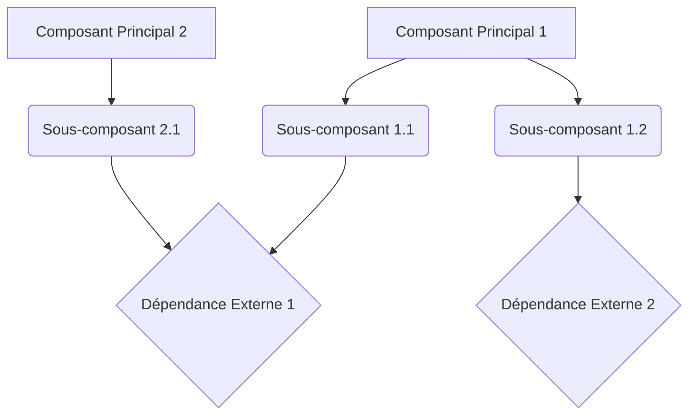

# Plan de Développement : [Nom du Projet]

## I. Objectif du Projet

[Décrire l'objectif principal du projet. Qu'est-ce que ce projet vise à accomplir ? Quel problème résout-il ?]

## II. Architecture Technique

[Décrire l'architecture technique générale du projet. Quels sont les principaux composants ? Quelles technologies seront utilisées ? Inclure un diagramme Mermaid si pertinent.]

*   **[Nom du Fichier/Module 1]**: [Description de son rôle. Ex: "Structure de base de la page, incluant l'élément `<canvas>` pour le rendu du jeu et les éléments d'interface utilisateur (score, carburant, messages)."]
*   **[Nom du Fichier/Module 2]**: [Description de son rôle.]
*   **[Nom du Fichier/Module N]**: [Description de son rôle.]

## III. Composants Clés du Projet

[Décrire les composants fonctionnels ou techniques clés du projet. Pour chaque composant, expliquer son rôle et ses responsabilités.]

1.  **[Nom du Composant 1]**:
    *   [Sous-composant/Fonctionnalité 1.1]: [Description]
    *   [Sous-composant/Fonctionnalité 1.2]: [Description]

2.  **[Nom du Composant 2]**:
    *   [Sous-composant/Fonctionnalité 2.1]: [Description]
    *   [Sous-composant/Fonctionnalité 2.2]: [Description]

3.  **[Nom du Composant N]**:
    *   [Sous-composant/Fonctionnalité N.1]: [Description]
    *   [Sous-composant/Fonctionnalité N.2]: [Description]

## IV. Étapes d'Implémentation (Ordre Suggéré)

[Lister les étapes d'implémentation du projet dans un ordre logique. Chaque étape devrait être suffisamment détaillée pour être actionable.]

1.  **Phase 1 - [Titre de la Phase 1]**:
    *   [Tâche 1.1]: [Description de la tâche]
    *   [Tâche 1.2]: [Description de la tâche]

2.  **Phase 2 - [Titre de la Phase 2]**:
    *   [Tâche 2.1]: [Description de la tâche]
    *   [Tâche 2.2]: [Description de la tâche]

3.  **Phase N - [Titre de la Phase N]**:
    *   [Tâche N.1]: [Description de la tâche]
    *   [Tâche N.2]: [Description de la tâche]

## V. Améliorations Futures / Fonctionnalités Optionnelles

[Lister les fonctionnalités ou améliorations qui pourraient être ajoutées après la réalisation des objectifs principaux.]

*   [Amélioration 1]
*   [Amélioration 2]
*   [Amélioration N]