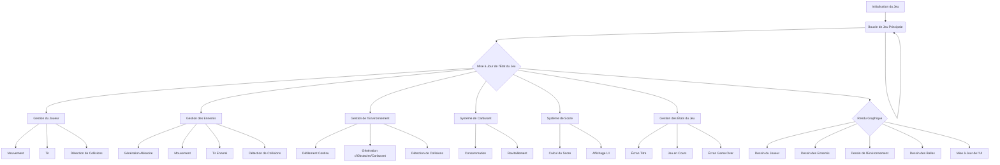

# Plan de Développement : Clone de River Raid (Web)

## I. Objectif du Projet

Créer une version simplifiée et jouable de River Raid directement dans un navigateur web, en utilisant les technologies front-end standard.

## II. Architecture Technique

Le jeu sera une application web front-end autonome, ne nécessitant aucun serveur ou base de données. Tout le jeu sera géré côté client.

*   **HTML (`index.html`)**: Structure de base de la page, incluant l'élément `<canvas>` pour le rendu du jeu et les éléments d'interface utilisateur (score, carburant, messages).
*   **CSS (`style.css`)**: Styles pour la mise en page générale, le canvas, et les éléments d'interface utilisateur.
*   **JavaScript (`script.js`)**: Le cœur de la logique du jeu, incluant le moteur de jeu, la gestion des entités (joueur, ennemis, environnement), la détection des collisions, le système de carburant, et les interactions utilisateur.

## III. Composants Clés du Jeu

1.  **Boucle de Jeu Principale**:
    *   Utilisation de `requestAnimationFrame` pour une mise à jour et un rendu fluides.
    *   Mise à jour de l'état du jeu (positions, collisions, score, carburant).
    *   Rendu de tous les éléments sur le canvas.

2.  **Joueur (Avion)**:
    *   **Mouvement**: Contrôle horizontal (gauche/droite) via les touches du clavier.
    *   **Tir**: Tir continu ou sur pression d'une touche. Gestion des balles du joueur.
    *   **Collision**: Détection des collisions avec les bords de la rivière, les ponts, les ennemis et leurs tirs.

3.  **Ennemis (Bateaux, Avions)**:
    *   **Génération**: Apparition aléatoire ou basée sur un schéma prédéfini le long de la rivière.
    *   **Mouvement**: Déplacement vertical (défilement avec l'écran) et potentiellement horizontal.
    *   **Tir**: Certains ennemis pourront tirer.
    *   **Destruction**: Les ennemis sont détruits par les tirs du joueur.

4.  **Environnement (Rivière, Ponts, Dépôts de Carburant)**:
    *   **Défilement**: La carte défile continuellement vers le bas, simulant le mouvement de l'avion.
    *   **Génération**: Génération dynamique des éléments de l'environnement (bords de rivière, ponts, dépôts de carburant) à mesure que le jeu progresse.
    *   **Ponts**: Obstacles destructibles par le joueur.
    *   **Dépôts de Carburant**: Objets à collecter pour recharger le carburant.

5.  **Système de Carburant**:
    *   **Consommation**: Le carburant diminue constamment.
    *   **Ravitaillement**: Le joueur doit voler au-dessus des dépôts de carburant pour recharger.
    *   **Game Over**: Si le carburant atteint zéro.

6.  **Système de Score**:
    *   Augmentation du score en détruisant des ennemis et des ponts.
    *   Affichage du score en temps réel.

7.  **Interface Utilisateur (UI)**:
    *   Affichage du score et du niveau de carburant.
    *   Écran de démarrage/titre.
    *   Écran "Game Over" avec option de redémarrage.

## IV. Étapes d'Implémentation (Ordre Suggéré)

1.  **Configuration Initiale**:
    *   Créer `index.html` avec un élément `<canvas>`.
    *   Créer `style.css` pour le style de base.
    *   Créer `script.js` et initialiser la boucle de jeu avec `requestAnimationFrame`.

2.  **Joueur et Mouvement**:
    *   Dessiner l'avion du joueur sur le canvas.
    *   Implémenter le mouvement horizontal du joueur via les écouteurs d'événements clavier.

3.  **Défilement de l'Environnement**:
    *   Implémenter un arrière-plan qui défile verticalement pour simuler la rivière.
    *   Dessiner les bords de la rivière.

4.  **Tir du Joueur**:
    *   Implémenter la logique de tir pour l'avion du joueur (création et mouvement des balles).
    *   Dessiner les balles.

5.  **Génération et Mouvement des Ennemis**:
    *   Créer une classe/objet pour les ennemis (bateaux).
    *   Implémenter la génération aléatoire d'ennemis.
    *   Implémenter le mouvement des ennemis (défilement vertical).

6.  **Détection de Collisions**:
    *   Implémenter la détection de collision entre le joueur et les bords de la rivière/ennemis.
    *   Implémenter la détection de collision entre les balles du joueur et les ennemis.

7.  **Système de Carburant et Dépôts**:
    *   Implémenter la consommation de carburant.
    *   Générer et dessiner les dépôts de carburant.
    *   Implémenter la logique de ravitaillement lorsque le joueur passe sur un dépôt.

8.  **Ponts**:
    *   Générer et dessiner les ponts.
    *   Implémenter la destruction des ponts par les tirs du joueur.

9.  **UI et États du Jeu**:
    *   Afficher le score et le carburant.
    *   Implémenter les écrans de démarrage et de fin de partie.

10. **Améliorations (si le temps le permet)**:
    *   Différents types d'ennemis avec des comportements variés.
    *   Effets sonores et musique.
    *   Système de niveaux ou de difficulté croissante.
    *   Optimisation des performances.