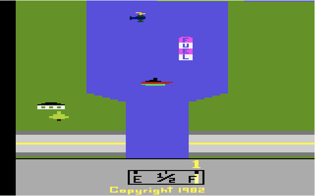

# River Raid



## Table des Matières
1.  [Introduction](#introduction)
2.  [Fonctionnalités](#fonctionnalités)
3.  [Démarrage Rapide](#démarrage-rapide)
4.  [Documentation Complète](#documentation-complète)
    *   [Documentation d'Architecture Technique (DAT)](#documentation-darchitecture-technique-dat)
    *   [Guide Utilisateur](#guide-utilisateur)
    *   [Plan de Développement](#plan-de-développement)
5.  [Configuration du Dépôt](#configuration-du-dépôt)
6.  [Contribution](#contribution)
7.  [Licence](#licence)
8.  [Contact](#contact)

---

## Introduction

River Raid est une recréation web du célèbre jeu vidéo classique "River Raid" sorti sur Atari 2600. Ce projet vise à reproduire l'expérience de jeu originale dans un navigateur web, en utilisant des technologies front-end standard (HTML, CSS, JavaScript).

Ce projet a pour mission de fournir une version jouable et fidèle de River Raid, accessible directement via un navigateur, tout en servant de démonstration des capacités de développement de jeux simples en JavaScript.

## Fonctionnalités

*   **Gameplay fidèle**: Reproduction des mécaniques de jeu originales de River Raid, incluant le défilement vertical, la gestion du carburant, les ennemis variés (hélicoptères, bateaux, avions, ponts) et les tirs.
*   **Graphismes et Sons**: Tentative de fidélité visuelle et sonore à l'original (bien que les sons ne soient pas encore implémentés).
*   **Contrôles intuitifs**: Utilisation des touches du clavier pour le mouvement et le tir.
*   **Gestion du Score et du Carburant**: Affichage du score actuel et de la jauge de carburant, avec des dépôts de carburant à collecter.

## Démarrage Rapide

Suivez ces étapes pour lancer River Raid rapidement :

1.  **Cloner le dépôt**:
    ```bash
    git clone https://github.com/votre-utilisateur/kilocode.git
    cd kilocode/riverraid
    ```
2.  **Lancer l'application**:
    Ouvrez le fichier `index.html` dans votre navigateur web préféré.

## Documentation Complète

Pour une compréhension approfondie du projet, veuillez consulter les documents suivants :

### Documentation d'Architecture Technique (DAT)
Ce document détaille l'architecture technique de l'application, les décisions de conception clés (ADR), et les schémas d'architecture.
[Lien vers la DAT (ex: `docs/dat.md`)](docs/dat.md)

### Guide Utilisateur
Ce guide fournit des instructions détaillées sur l'utilisation de l'application, ses fonctionnalités et des conseils de dépannage.
[Lien vers le Guide Utilisateur (ex: `docs/guide_utilisateur.md`)](docs/guide_utilisateur.md)

### Plan de Développement
Ce document décrit les objectifs du projet, les composants clés et les étapes d'implémentation.
[Lien vers le Plan de Développement (ex: `docs/plan_developpement.md`)](docs/plan_developpement.md)

## Configuration du Dépôt

Ce dépôt inclut un fichier `.gitignore` pour exclure les fichiers et dossiers non pertinents du contrôle de version.

## Contribution

Nous accueillons les contributions ! Veuillez consulter notre [Guide de Contribution](CONTRIBUTING.md) pour plus de détails. (Note: Le fichier CONTRIBUTING.md n'existe pas encore et est un placeholder.)

## Licence

Ce projet est sous licence MIT - voir le fichier [LICENCE.md](LICENCE.md) pour plus de détails. (Note: Le fichier LICENCE.md n'existe pas encore et est un placeholder.)

## Contact

Pour toute question ou suggestion, n'hésitez pas à nous contacter :
*   **Email**: contact@example.com
*   **GitHub Issues**: [Lien vers les issues GitHub du projet](https://github.com/votre-utilisateur/kilocode/issues)